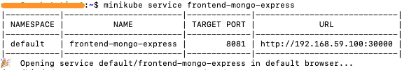

# Task 4: Create the frontend
## Configmap
A ConfigMap in Kubernetes is an object used to store configuration data in key-value pairs. It provides a way to decouple configuration artifacts from container images, allowing you to manage configurations separately from the application code.

ConfigMaps are commonly used to store non-sensitive, configuration-specific data, such as environment variables, command-line arguments, configuration files, or other settings required by applications running in Kubernetes pods.

We need to configure the mongodb-configmap to store the `database_url: backend-mongodb` value for reference in the Frontend. [Full file is here](./example1-mongoApp/mongodb-configmap.yaml):

```
apiVersion: v1
kind: ConfigMap
metadata:
  name: mongodb-configmap
data:
  database_url: backend-mongodb
```

## Apply the ConfigMap
```bash
kubectl apply -f example1-mogoApp/mongodb-configmap.yaml
```

## Frontend Deployment:
First, we need to set up the `Kind` as `Deployment`, the name and the same bacis Replicas and Selector as before

```
apiVersion: apps/v1
kind: Deployment
metadata:
  name: frontend-mongo-express-deployment
  labels:
    app: frontend-mongo-express
spec:
  replicas: 1
  selector:
    matchLabels:
      app: frontend-mongo-express
  template:
    metadata:
      labels:
        app: frontend-mongo-express
```
Then, we will set a container image that is preconfigured with MongoExpress: `mongo-express`. We will also set the default port. And we will configure `ME_CONFIG_MONGODB_ADMINUSERNAME` and `ME_CONFIG_MONGODB_ADMINPASSWORD` envineroment variables
```
    spec:
      containers:
      - name: mongo-express
        image: mongo-express
        ports:
        - containerPort: 8081
        env:
        - name: ME_CONFIG_MONGODB_ADMINUSERNAME
          valueFrom:
            secretKeyRef:
              name: mongodb-secret
              key: mongo-username
        - name: ME_CONFIG_MONGODB_ADMINPASSWORD
          valueFrom: 
            secretKeyRef:
              name: mongodb-secret
              key: mongo-password
```
The last thing we need to add in the deployment is setting up the Database server name. We will do that using hte ConfigMap data we set earlier
```
        - name: ME_CONFIG_MONGODB_SERVER
          valueFrom: 
            configMapKeyRef:
              name: mongodb-configmap
              key: database_url
```

## Frontend Service:
The service for the frontend deployment is slightly different than the service do the backend deployment. In the frontend Service we will need to expose it to the internet:
```
apiVersion: v1
kind: Service
metadata:
  name: frontend-mongo-express
spec:
  selector:
    app: frontend-mongo-express
  type: LoadBalancer  
  ports:
    - protocol: TCP
      port: 8081
      targetPort: 8081
      nodePort: 30000
```
Notice that we set the `type` to `LoadBalancer`, which will expose this service externally. And we had to add `nodePort: 30000` which will set the port to be used externally.

## Apply the Frontend
```bash
kubectl apply -f example1-mogoApp/frontend-mongo-express.yaml
```

## Expose the Frontend using Minikube
```bash
minikube service frontend-mongo-express
```
The above commmand will expose `frontend-mongo-express` service and give it a public IP address


You can access the frontend by poiting your broswer to the IP address that was assigned. Notice that Mongo-express allows you to interact with the backend which is the MongoDB server (Service)

Congratulations! Your Application is built!